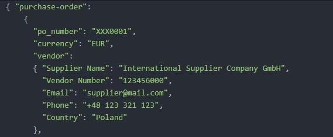
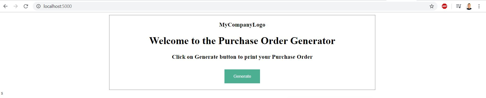
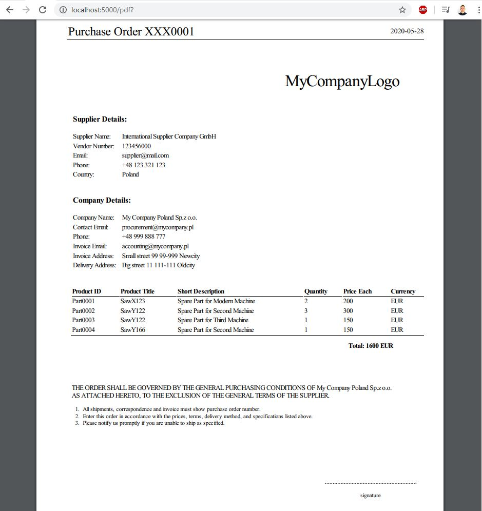

Application description:

<ul>
  <li>Flask framework applied</li>
  <li></li>
  <li>Purpose: Application converts raw order data and prints it into PDF file.</li>
  <li>In procurement, PDF file is the final file being sent over to a supplier to fulfil the order.</li>
</ul>

Data input: JSON file:

Home Page:

PO printed in PDF format:

